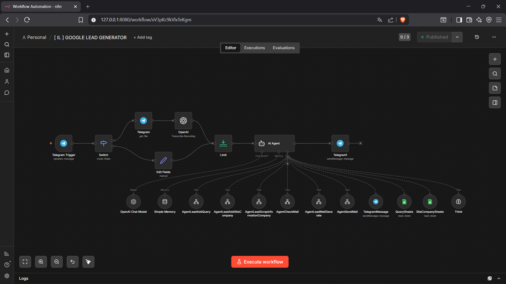
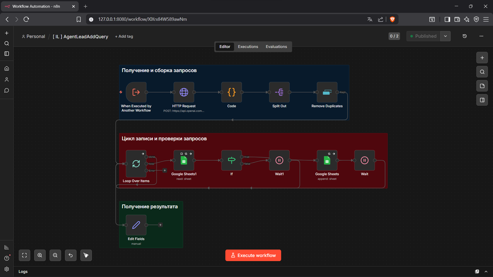
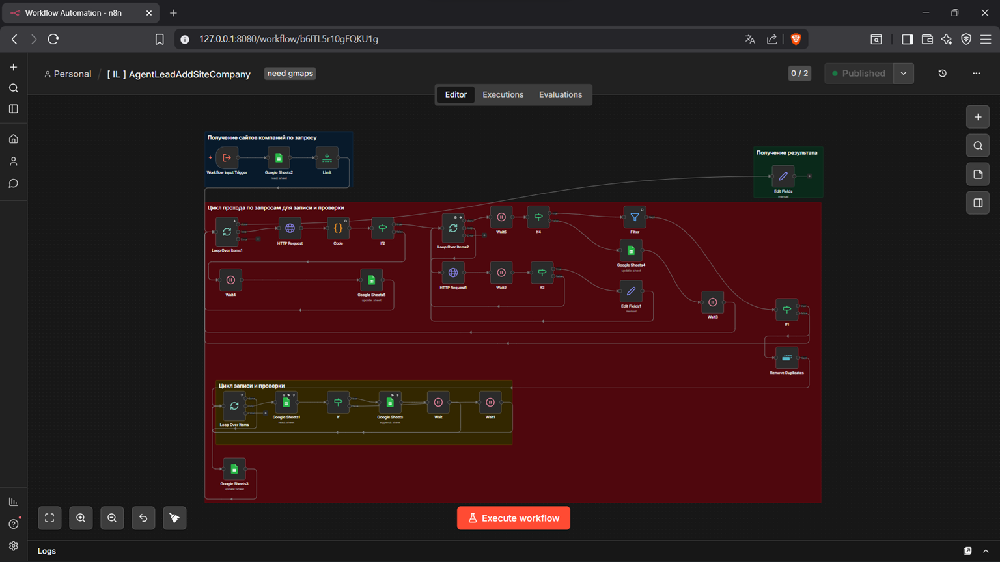
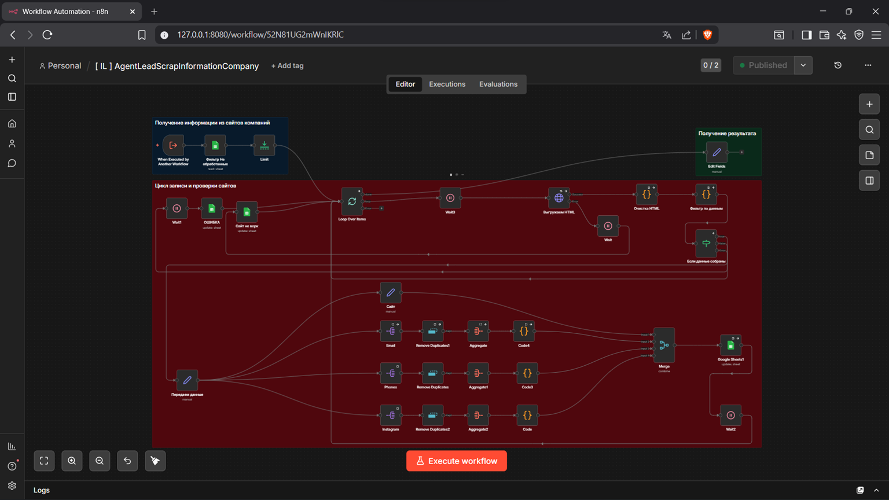
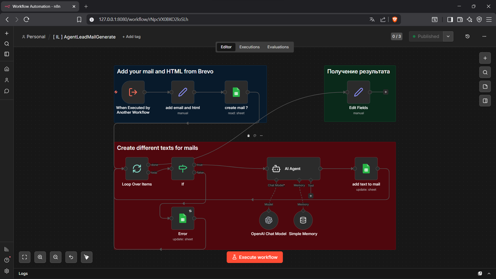
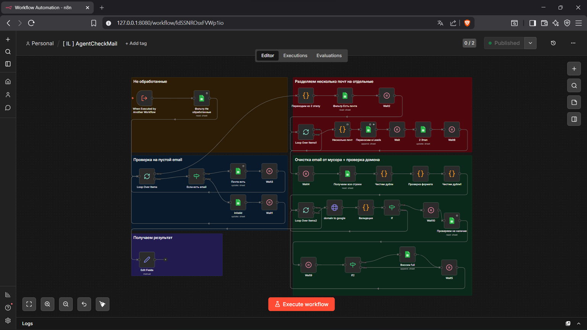
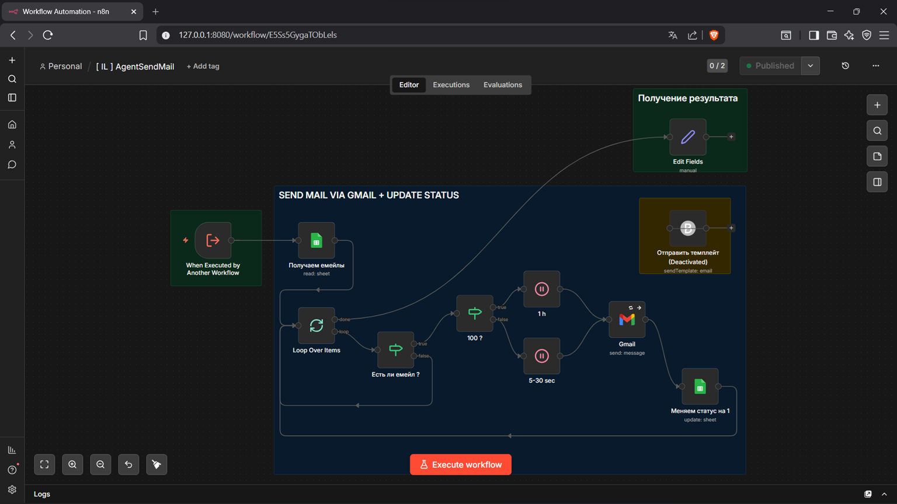
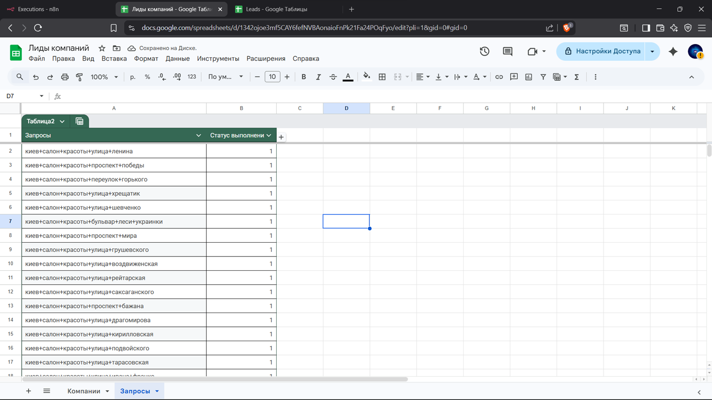
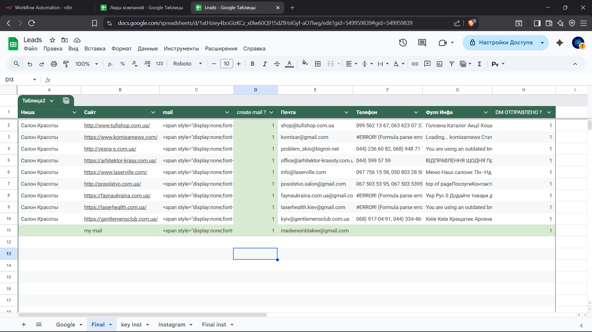
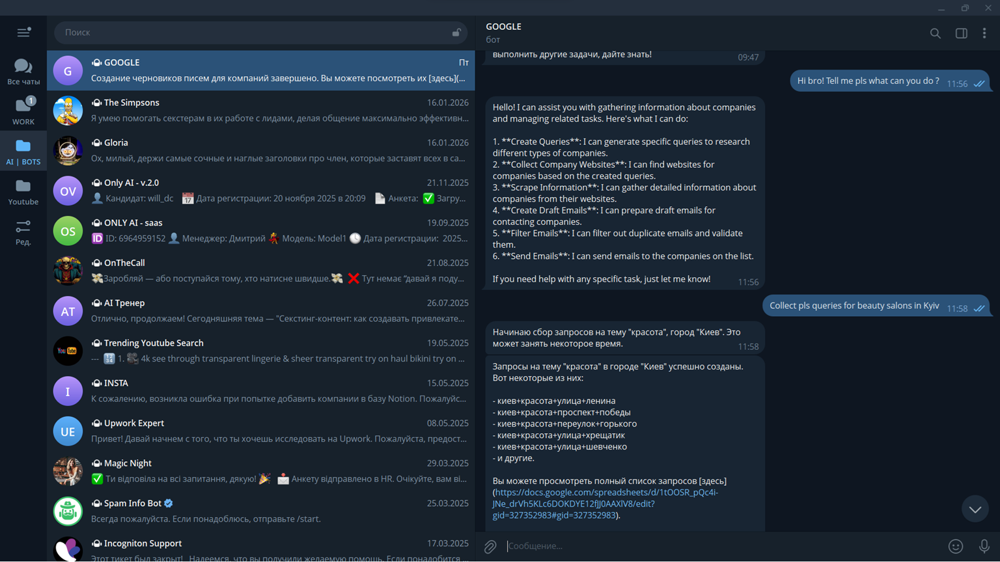

# Screenshots & Demo Videos — v1.0 (Google Maps Edition)

> This file contains placeholder sections for all screenshots and demo videos for **v1.0**.  
> Add your screenshots to the `/images/` folder and update the links below.

---

## Screenshots

### 1. Main Workflow — `[IL] GOOGLE LEAD GENERATOR`
*(v1.0 — Main Orchestrator)*

> Upload screenshot as: `images/workflow-main.png`

**What to show:**
- Full canvas view of the main orchestrator
- Telegram Trigger, Switch, OpenAI Whisper, AI Agent, Telegram reply
- All tool connections at the bottom

---

### 2. Query Generator Workflow — `[IL] AgentLeadAddQuery`
*(Generates Google Maps search queries)*

> Upload screenshot as: `images/workflow-query-generator.png`

**What to show:**
- HTTP Request to OpenAI
- Code node (query parsing)
- Remove Duplicates node
- Google Sheets append

---

### 3. Google Maps Scraper — `[IL] AgentLeadAddSiteCompany`
*(Core v1.0 — Google Maps scraping)*

> Upload screenshot as: `images/workflow-scraper.png`

**What to show:**
- Google Sheets read (queries)
- Google Maps scraping step
- Google Sheets write (SiteCompany)

---

### 4. Company Info Extractor — `[IL] AgentLeadScrapInformationCompany`

> Upload screenshot as: `images/workflow-scraper-info.png`

**What to show:**
- Website URL loop
- Email extraction logic
- Google Sheets write (Final tab)

---

### 5. Email Generator Workflow — `[IL] AgentLeadMailGenerate`

> Upload screenshot as: `images/workflow-email-generator.png`

**What to show:**
- Edit Fields node (HTML template injection)
- Google Sheets filter (`create mail? = 0`)
- AI Agent generating HTML email
- Google Sheets update (`create mail? = 1`)

---

### 6. Email Validator — `[IL] AgentCheckMail`

> Upload screenshot as: `images/workflow-check-mail.png`

**What to show:**
- Email validation logic
- DM? column update

---

### 7. Email Sender — `[IL] AgentSendMail`

> Upload screenshot as: `images/workflow-send-mail.png`

**What to show:**
- Gmail send node
- Lead data from Google Sheets
- Status update after send

---

### 8. Google Sheets — Query Database

> Upload screenshot as: `images/sheets-queries.png`

**What to show:**
- Example of populated `Queries` tab
- Multiple query rows (e.g., "dentists Kyiv", "beauty salons Berlin")

---

### 9. Google Sheets — SiteCompany Database
*(v1.0 — data sourced from Google Maps)*

> Upload screenshot as: `images/sheets-site-company.png`

**What to show:**
- Example of populated `SiteCompany` tab
- Columns: name, address, phone, website
- Data scraped from Google Maps

---

### 10. Google Sheets — Leads Database (Final)

> Upload screenshot as: `images/google-sheets-result.png`

**What to show:**
- Example of populated `Final` tab
- Columns: name, email, website, mail (HTML), create mail?, DM?
- At least one row with generated HTML email content

---

### 11. Telegram Bot — Example Conversation

> Upload screenshot as: `images/telegram-demo.png`

**What to show:**
- User sends command (e.g., `collect dentists Kyiv`)
- Bot responds with status update
- Example of voice message transcription (optional)

---

## Demo Videos

### Full System Demo (v1.0 — Google Maps Edition)

**YouTube Link:** *(to be added)*

**What to show:**
- Full end-to-end run from Telegram command to email sent
- Screen recording of n8n execution
- Google Maps scraping in action
- Google Sheets filling up in real time
- Final email received in inbox

---

### Workflow Demos (Individual)

| Workflow | YouTube Link | Duration |
|---|---|---|
| `[IL] GOOGLE LEAD GENERATOR` | *(to be added)* | ~3 min |
| `[IL] AgentLeadAddQuery` | *(to be added)* | ~2 min |
| `[IL] AgentLeadAddSiteCompany` | *(to be added)* | ~3 min |
| `[IL] AgentLeadScrapInformationCompany` | *(to be added)* | ~3 min |
| `[IL] AgentCheckMail` | *(to be added)* | ~1 min |
| `[IL] AgentLeadMailGenerate` | *(to be added)* | ~2 min |
| `[IL] AgentSendMail` | *(to be added)* | ~2 min |

---

## How to Add Screenshots

1. Take a screenshot of the n8n workflow canvas
2. Save with the filename listed above
3. Upload to the `/images/` folder in this repository
4. The image will automatically appear in this doc and in the README

**Recommended screenshot resolution:** 1920x1080 or higher  
**Recommended format:** PNG  
**Recommended tool:** n8n built-in canvas zoom + browser screenshot

---

> **v1.0 — Google Maps Edition** | Next: v2.0 (LinkedIn), v3.0 (Multi-source)
